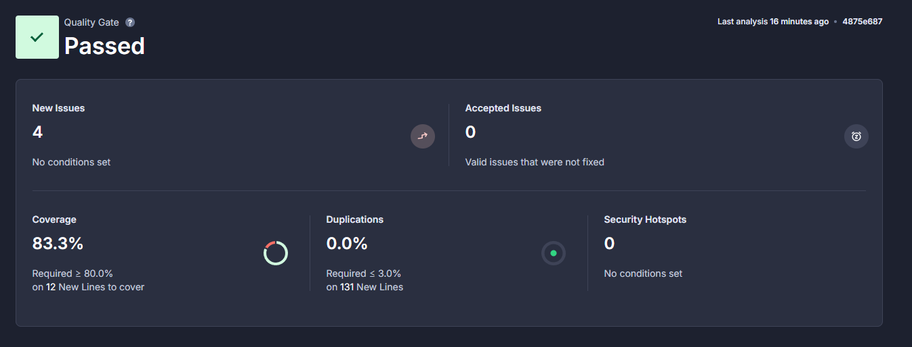
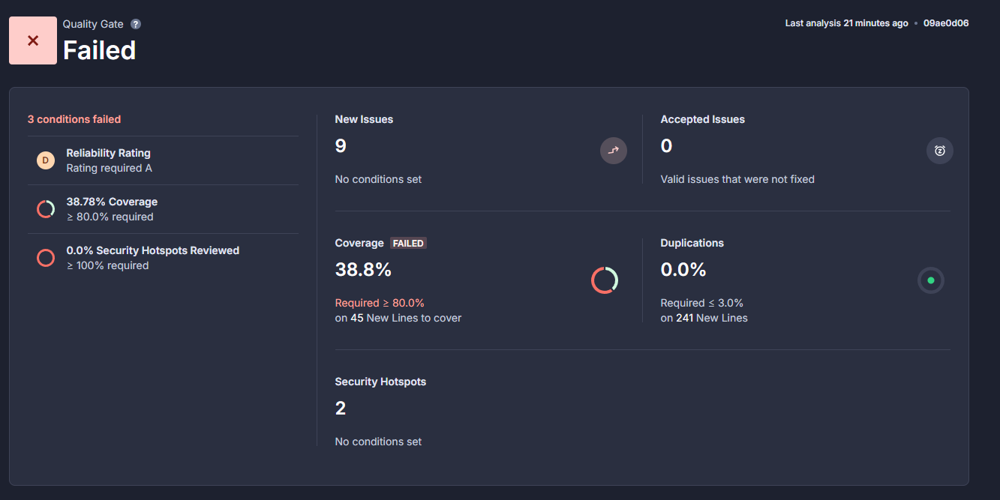
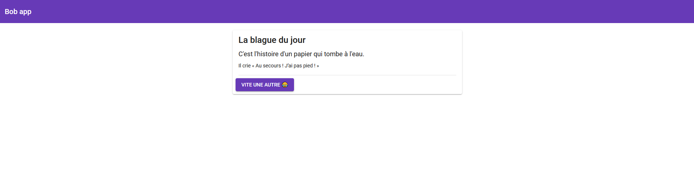

# 🅿️🔟 Gérez un projet collaboratif en intégrant une démarche CI/CD

## 💁🏻‍♀️ Résumé du projet BobApp ! 

### 👉🏻 Contexte:

Ça fait 3 ans que Bob a lancé son application ! Chaque jour le nombre de visiteurs augmente, mais cela devient compliqué pour Bob de gérer cela tout seul. Il a passé le projet sous licence open source, mais peu de personnes se sont investies pour l’instant.

## 🎢 Mise en place d'une pipeline CI/CD avec GitHub Actions, Docker et SonarCloud

Le présent document a pour objectif de décrire la configuration d'une pipeline d'intégration et de déploiement continus (CI/CD) reposant sur GitHub Actions, Docker et SonarCloud. Cette pipeline automatisera les tâches de build, de test et de déploiement de l'application, tout en garantissant un haut niveau de qualité du code.

## 🛠️ Outils utilisés

* GitHub Actions: Plateforme d'automatisation CI/CD native à GitHub, permettant de définir des workflows personnalisés pour chaque projet.
* Docker: Outil de conteneurisation permettant de créer des environnements d'exécution isolés et reproductibles pour les applications.
* SonarCloud: Plateforme d'analyse de code statique offrant une vue détaillée de la qualité du code et permettant d'identifier les potentielles vulnérabilités, les bugs et les améliorations possibles.

## 🏗️ Architecture

### 🚧 L'architecture de la pipeline CI/CD est la suivante :

* GitHub: Le dépôt source de l'application, déclencheur des workflows GitHub Actions.
* Registre Docker (Docker Hub): Stockage des images Docker générées par la pipeline.
* SonarCloud: Plateforme d'analyse de code, intégrée à la pipeline pour fournir des métriques de qualité en continu.

## ⚠️ Avant de se lancer :

### 📃 Suivez les étapes suivantes pour crée vos comptes sur les outils nécéssaires  :

* Créer un compte Docker Hub: 
Pour créer un compte Docker Hub, rendez-vous sur le site [Docker Hub](https://hub.docker.com/) et cliquez sur le bouton "Sign Up" pour créer un compte.
* Créer un compte SonarCloud : 
Pour créer un compte SonarCloud, rendez-vous sur le site [SonarCloud](https://sonarcloud.io/) et cliquez sur le bouton "Log In" pour créer un compte.
* Créer un dossier contenant les github actions
Créez un dossier `.github/workflows` à la racine de votre projet et ajoutez y les fichiers `****.yml` contenant les actions à exécuter lors des événements spécifiques sur votre dépôt GitHub.

## ↘️ Configuration de la pipeline 🚀

#### 📡 Creation de 2 fichiers github actions

Dans le dossier `.github/workflows`,création d'un fichier "FrontEnd.yml" pour le frontend et un fichier " Backend.yml " pour le backend:

*Voir les commentaires dans les fichiers respectifs pour plus de detail*

Ces 2 fichiers contiennent les actions à exécuter lors des événements spécifiques sur le dépôt GitHub.

#### 🔐 Ajout des secrets dans GitHub

Pour que les actions puissent accéder à SonarCloud et DockerHub on doit ajouter les secrets:

* Accéder aux paramètres de votre repository GitHub :  

Dans le menu de gauche, cliquez sur "Secrets and variables" puis sur "Actions".  
Cliquez sur "New repository secret" (Nouveau secret de repository).  
Ajoutez les secrets suivants :  

* **DOCKER_USERNAME** : Votre nom d'utilisateur Docker Hub.  
* **DOCKER_PASSWORD** : Votre mot de passe Docker Hub.  
* **SONAR_TOKEN_FRONT** : Votre jeton d'accès SonarCloud pour le frontend (généré dans SonarCloud sous "My Account" > "Security").  
* **SONAR_TOKEN_BACK** : Votre jeton d'accès SonarCloud pour le backend (généré dans SonarCloud sous "My Account" > "Security").  

## 📔 Configuration de Karma et JaCoCo pour les tests & couverture de code: 
Pour le frontend, on utilise Karma pour les tests et JaCoCo pour la couverture de code.  

#### ➡️ Configuration de Karma

Le fichier `karma.conf.js` fourni dans le projet, contient la configuration de Karma. Modification pour les tests en mode headless et la génération des rapports de couverture de code (voir les commentaires dans le fichier pour plus de détails).  
Notament, la configuration de `browsers` à `ChromeHeadless` pour les tests en mode headless et `lcov` pour la génération des rapports de couverture de code pour SonarCloud.  
Modification de `package.json` pour ajouter les scripts de test en mode ChromeHeadLess.
#### ➡️ Configuration de JaCoCo

Le fichier `pom.xml` fourni dans le projet, contient la configuration de JaCoCo. Modification pour la génération des rapports de couverture de code (voir les commentaires dans le fichier pour plus de détails).

## 🌐 Workflow pour le FrontEnd

Ce workflow GitHub Actions est conçu pour automatiser les tâches liées au développement frontend d'une application nommée "Bobapp". Il couvre les étapes allant de la construction et des tests à la création et au déploiement d'une image Docker.

#### Déclencheurs du workflow:

* Push sur la branche CI-CD-P10: Le workflow entier est déclenché lorsqu'un nouveau commit est poussé sur cette branche.
* Pull request : ouvert, synchronisé, réouvert: Le job Frontend est déclenché lors de ces événements sur une pull request.
Jobs du workflow

#### Frontend
* Configuration de Node.js: Utilise la version 14.x de Node.js pour un environnement de build cohérent.
* Installation des dépendances: Exécute npm ci pour installer les dépendances du projet.
* Build: Exécute npm build pour compiler l'application frontend.
* Tests: Exécute npm test pour lancer les tests unitaires.
* Couverture de code: Collecte les résultats de la couverture de code pour évaluer la qualité du code.
* Analyse SonarCloud: Envoie le code à SonarCloud pour une analyse approfondie de la qualité et de la sécurité.

#### DockerLogAndBuild

* Connexion à Docker Hub: Se connecte au registre Docker Hub à l'aide des informations d'identification fournies.
* Build et push de l'image: Construit une image Docker de l'application frontend, la tague avec un nom spécifique et la pousse vers Docker Hub.
* Étapes clés et explications
* Matrix: Permet de tester le workflow avec différentes versions de Node.js (bien que seule la version 14.x soit définie dans cet exemple).
* Caching: Cache les dépendances npm pour accélérer les builds ultérieurs.
* Artifacts: Archive les résultats de la couverture de code pour une inspection ultérieure.
* SonarCloud: Intègre SonarCloud pour analyser la qualité du code et identifier les potentiels problèmes.
* Docker: Crée une image Docker pour faciliter le déploiement de l'application dans un environnement de conteneur.

## 🧭 Workflow pour le BackEnd

## 📍 Ajout des KPIs (via SonarCloud et des Quality Gates)
Ajout de KPIs (Key Performance Indicators) au projet via des Quality Gates.

### KPI num 1: Coverage 📌
Le KPI num 1 est la couverture de code. Il est mesuré par JaCoCo et affiché dans SonarCloud. Le Quality Gate pour ce KPI est de 80%. Ca signifie que le code doit avoir une couverture de code de 80% ou plus pour passer le Quality Gate.

### KPI num 2: Security hotspots Reviewed 📌
Le KPI num 3 est le nombre de Security Hotspots Reviewed. Un Security Hotspot est un indicateur de risque potentiel dans le code qui nécessite une attention particulière pour garantir qu'il ne devienne pas une vulnérabilité de sécurité.

## 📊 Analyse des metriques et retours utilisateurs

#### Couverture de code frontend

* **Couverture de tests (Coverage)** : Le projet affiche une couverture de 83.3%, dépassant le seuil minimum requis de 80%. Ce résultat suggère que la plupart du code est couvert par des tests unitaires, ce qui diminue le risque de bugs et facilite la détection des régressions potentielles lors de futures modifications.

* **Duplications de code (Duplications)** : Le taux de duplication de code est de 0.0%, bien en dessous du seuil maximum de 3% pour les nouvelles lignes de code (131 lignes analysées). L’absence de duplication contribue à améliorer la maintenabilité du code en limitant les sections de code redondantes.

* **Hotspots de sécurité (Security Hotspots)** : Aucun hotspot de sécurité n’a été détecté dans le code analysé, ce qui est positif pour la sécurité globale du projet et indique qu’il n’existe pas de zones critiques exposant le code à des risques de vulnérabilité.
*
***Bien que 4 nouvelles issues aient été détectées, elles n’ont pas été considérées comme bloquantes pour la Quality Gate, car elles ne relèvent pas de conditions qui échoueraient le projet. Il n’y a également aucune issue acceptée, ce qui signifie qu’aucun problème antérieur n’a été laissé sans résolution.***

#### Couverture de code backend

* **Note de fiabilité (Reliability Rating)** : Le projet présente une note de fiabilité inférieure au niveau requis (A), ce qui indique la présence de problèmes potentiels de stabilité ou de fiabilité dans le code.

* **Couverture de tests (Coverage)** : Le taux de couverture des tests unitaires est de 38.78%, alors que l'objectif minimal est fixé à 80%. Cela signifie que moins de la moitié du code est couvert par des tests, ce qui augmente le risque que des bugs passent inaperçus. Une couverture faible peut aussi rendre plus difficile la détection de régressions lors des changements futurs.

* **Examen des hotspots de sécurité **: Aucun des hotspots de sécurité détectés n’a été examiné, avec un taux de 0.0% de Security Hotspots Reviewed. Ce paramètre exige que tous les hotspots soient analysés, car ceux-ci représentent des zones critiques pour la sécurité du code et peuvent contenir des vulnérabilités potentielles.

***En complément, l’analyse montre qu’il y a 9 nouvelles issues qui nécessitent une attention, et 2 hotspots de sécurité spécifiques à analyser. Aucune duplication de code n’est présente, ce qui est un point positif pour la maintenabilité du projet.***

#### 🙋‍♂️ Retours utilisateurs 👥

#### "Je mets une étoile car je ne peux pas en mettre zéro ! Impossible de poster une suggestion de blague, le bouton tourne et fait planter mon navigateur"

* **Contexte** : Ce retour d’utilisateur mentionne un problème inexistant, car il n’y a pas de fonctionnalité permettant de poster des suggestions de blagues dans l’application actuelle.
* **Solution proposée** : Il serait judicieux de clarifier les fonctionnalités existantes sur le site ou l’application pour éviter ce type de confusion. Cependant, on pourrait également envisager une évolution de l’application pour inclure un formulaire de suggestion de blagues, ce qui répondrait à ce besoin exprimé par l’utilisateur.
* **Améliorations via CI/CD** : La mise en place de pipelines de tests (unitaires et fonctionnels) permettrait de détecter rapidement ce genre de fausse attente utilisateur si un jour une fonctionnalité de suggestions était intégrée. En intégrant des quality gates via Sonar, on s’assurerait aussi que les nouvelles fonctionnalités respectent les normes de qualité.
« Bug sur le post de vidéo »

#### "#BobApp j'ai remonté un bug sur le post de vidéo il y a deux semaines et il est encore présent ! Les devs vous faites quoi????"
* **Contexte** : L’application n'a pas de fonction de post de vidéo. Cette confusion pourrait venir d’une mauvaise compréhension des fonctionnalités ou d’un problème de communication sur les limites de l'application.
* **Solution proposée** : Ajouter des informations dans l’interface utilisateur pour préciser que l’application est dédiée uniquement à la consultation de blagues, sans support pour les vidéos. Cela pourrait se faire via une FAQ ou une clarification dans la description de l'application.
* **Améliorations via CI/CD** : En automatisant les tests d'interface et en intégrant des tests de non-régression, on pourrait garantir que les fonctionnalités visibles soient celles qui fonctionnent réellement, et qu'il n'y ait pas de confusions possibles pour l’utilisateur.

#### "Ca fait une semaine que je ne reçois plus rien, j'ai envoyé un email il y a 5 jours mais toujours pas de nouvelles..."

* **Contexte** : Un utilisateur indique ne plus recevoir de contenu, ce qui pourrait être lié à des problèmes de cache ou à une mauvaise gestion de la performance côté client.
* **Solution proposée** : La mise en place de tests de performance et d'intégration dans le pipeline CI/CD permettrait de détecter ce type de problèmes avant la mise en production. En cas de problème de cache ou de performance, le pipeline pourrait également inclure des étapes de validation pour vérifier que la génération de blagues fonctionne correctement dans diverses conditions réseau.
* **Améliorations via CI/CD** : En ajoutant des tests fonctionnels et des tests de charge dans le pipeline, on pourrait simuler ce genre de problème pour prévenir les blocages. De plus, la qualité du code pourrait être surveillée en continu pour éviter des ralentissements ou des erreurs de chargement grâce à SonnarCloud.

####  "J'ai supprimé ce site de mes favoris ce matin, dommage, vraiment dommage."

* **Contexte** : Un utilisateur a manifesté son mécontentement sans préciser de raison technique précise, ce qui peut être un signe de frustration vis-à-vis des performances ou des fonctionnalités.
* **Solution proposée** : En plus de CI/CD, une analyse de la performance (front-end et back-end) pourrait aider à identifier et à optimiser les parties lentes du site. L’intégration de quality gates comme Sonar va permettre d’assurer une couverture de test et de code de qualité pour minimiser les problèmes de production.
* **Améliorations via CI/CD** : Le déploiement continu et les quality gates permettront de prévenir ce genre de retours. Grâce aux tests, aux bonnes pratiques de code, et à l’intégration d’outils comme SonarCloud, on pourra minimiser les erreurs, améliorer la performance, et éviter les soucis de qualité.

### Avantages de la mise en place de CI/CD

**Automatisation des tests** : Avec un pipeline de tests automatisés, chaque mise à jour sera testée pour vérifier que le site reste fonctionnel et performant, limitant ainsi les retours négatifs liés à des erreurs non détectées.

**Quality Gates via Sonar** : En intégrant SonarQube pour surveiller la qualité du code, on s’assure que tout nouveau code respecte les normes de sécurité, de performance, et de maintenabilité. Cela minimise les risques de régression et de bugs, tout en améliorant la lisibilité et la structure du code.

**Gestion des images Docker** : La création d'images Docker permettrait de tester l'application dans un environnement isolé et standardisé, réduisant ainsi les risques d'erreurs dues aux variations de configuration entre développement et production. Le push automatique sur Docker Hub rend aussi le déploiement plus flexible et rapide.

**Amélioration de la performance** : Grâce aux tests de performance intégrés dans le pipeline CI/CD, on peut identifier et optimiser les sections lentes ou consommatrices de ressources, répondant ainsi aux attentes des utilisateurs pour une expérience fluide et rapide.

***En somme, la mise en place de CI/CD, associée à un audit des retours utilisateurs et à une optimisation continue, permettra non seulement de répondre aux critiques actuelles, mais aussi de prévenir les erreurs futures, d'augmenter la satisfaction des utilisateurs, et de garantir un site de haute qualité.***

