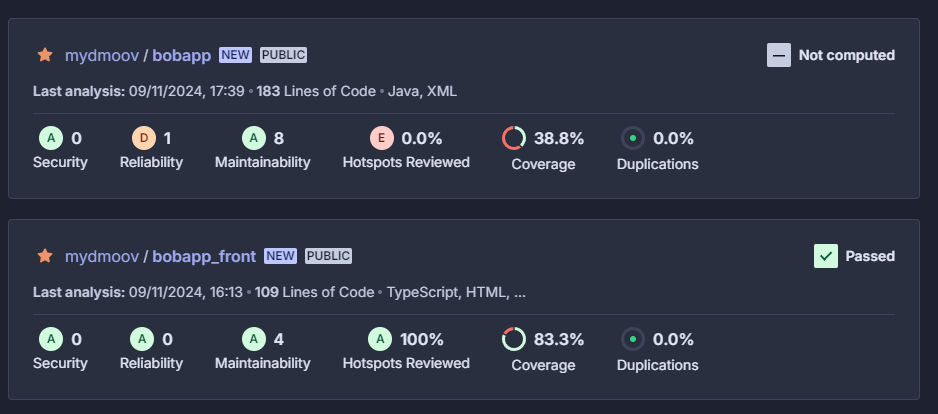
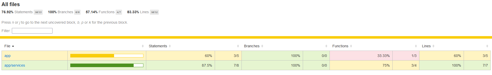
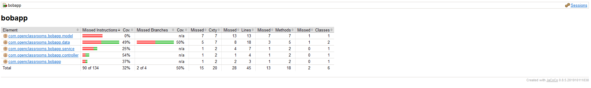

# 🅿️🔟 Gérez un projet collaboratif en intégrant une démarche CI/CD

## 💁🏻‍♀️ Résumé du projet BobApp ! 

### 👉🏻 Contexte:

Ça fait 3 ans que Bob a lancé son application ! Chaque jour le nombre de visiteurs augmente, mais cela devient compliqué pour Bob de gérer cela tout seul. Il a passé le projet sous licence open source, mais peu de personnes se sont investies pour l’instant.

## 🎢 Mise en place d'une pipeline CI/CD avec GitHub Actions, Docker et SonarCloud

Le présent document a pour objectif de décrire la configuration d'une pipeline d'intégration et de déploiement continus (CI/CD) reposant sur GitHub Actions, Docker et SonarCloud. Cette pipeline automatisera les tâches de build, de test et de déploiement de l'application, tout en garantissant un haut niveau de qualité du code.

## 🛠️ Outils utilisés

* GitHub Actions: Plateforme d'automatisation CI/CD native à GitHub, permettant de définir des workflows personnalisés pour chaque projet.
* Docker: Outil de conteneurisation permettant de créer des environnements d'exécution isolés et reproductibles pour les applications.
* SonarCloud: Plateforme d'analyse de code statique offrant une vue détaillée de la qualité du code et permettant d'identifier les potentielles vulnérabilités, les bugs et les améliorations possibles.

## 🏗️ Architecture

### 🚧 L'architecture de la pipeline CI/CD est la suivante :

* GitHub: Le dépôt source de l'application, déclencheur des workflows GitHub Actions.
* Registre Docker (Docker Hub): Stockage des images Docker générées par la pipeline.
* SonarCloud: Plateforme d'analyse de code, intégrée à la pipeline pour fournir des métriques de qualité en continu.

## ⚠️ Avant de se lancer :

### 📃 Suivez les étapes suivantes pour crée vos comptes sur les outils nécéssaires  :

* Créer un compte Docker Hub: 
Pour créer un compte Docker Hub, rendez-vous sur le site [Docker Hub](https://hub.docker.com/) et cliquez sur le bouton "Sign Up" pour créer un compte.
* Créer un compte SonarCloud : 
Pour créer un compte SonarCloud, rendez-vous sur le site [SonarCloud](https://sonarcloud.io/) et cliquez sur le bouton "Log In" pour créer un compte.
* Créer un dossier contenant les github actions
Créez un dossier `.github/workflows` à la racine de votre projet et ajoutez y les fichiers `****.yml` contenant les actions à exécuter lors des événements spécifiques sur votre dépôt GitHub.

## ↘️ Configuration de la pipeline 🚀

#### 📡 Creation de 2 fichiers github actions

Dans le dossier `.github/workflows`,création d'un fichier "FrontEnd.yml" pour le frontend et un fichier " Backend.yml " pour le backend:

*Voir les commentaires dans les fichiers respectifs pour plus de detail*

Ces 2 fichiers contiennent les actions à exécuter lors des événements spécifiques sur le dépôt GitHub.

#### 🔐 Ajout des secrets dans GitHub

Pour que les actions puissent accéder à SonarCloud et DockerHub on doit ajouter les secrets:

* Accéder aux paramètres de votre repository GitHub :  

Dans le menu de gauche, cliquez sur "Secrets and variables" puis sur "Actions".  
Cliquez sur "New repository secret" (Nouveau secret de repository).  
Ajoutez les secrets suivants :  

* **DOCKER_USERNAME** : Votre nom d'utilisateur Docker Hub.  
* **DOCKER_PASSWORD** : Votre mot de passe Docker Hub.  
* **SONAR_TOKEN_FRONT** : Votre jeton d'accès SonarCloud pour le frontend (généré dans SonarCloud sous "My Account" > "Security").  
* **SONAR_TOKEN_BACK** : Votre jeton d'accès SonarCloud pour le backend (généré dans SonarCloud sous "My Account" > "Security").  

## 📔 Configuration de Karma et JaCoCo pour les tests & couverture de code: 
Pour le frontend, on utilise Karma pour les tests et JaCoCo pour la couverture de code.  

#### ➡️ Configuration de Karma

Le fichier `karma.conf.js` fourni dans le projet, contient la configuration de Karma. Modification pour les tests en mode headless et la génération des rapports de couverture de code (voir les commentaires dans le fichier pour plus de détails).  
Notament, la configuration de `browsers` à `ChromeHeadless` pour les tests en mode headless et `lcov` pour la génération des rapports de couverture de code pour SonarCloud.  
Modification de `package.json` pour ajouter les scripts de test en mode ChromeHeadLess.
#### ➡️ Configuration de JaCoCo

Le fichier `pom.xml` fourni dans le projet, contient la configuration de JaCoCo. Modification pour la génération des rapports de couverture de code (voir les commentaires dans le fichier pour plus de détails).

## 🌐 Workflow pour le FrontEnd

## 🧭 Workflow pour le BackEnd

## 📍 Ajout des KPIs (via SonarCloud et des Quality Gates)
Ajout de KPIs (Key Performance Indicators) au projet via des Quality Gates.

### 1. Couverture de Tests - Code Coverage 📌
**KPI proposé** : Taux minimal de couverture des tests unitaires : 80%

**Justification** : Le taux de couverture des tests est essentiel pour assurer la qualité et la fiabilité du code. Dans les analyses SonarCloud, nous constatons une couverture de 83.3% pour le front-end, tandis que le back-end est à un faible niveau de 38.8%, bien en dessous du seuil minimum de 80%. Ce KPI de 80% garantit que le code est suffisamment couvert par des tests unitaires, réduisant ainsi le risque de régressions et de bugs non détectés. Ce niveau de couverture est également un standard de qualité dans l’industrie pour les projets bien testés.

### 2. Note de Fiabilité - Reliability Rating 📌
**KPI proposé** : Note minimale de fiabilité (Reliability Rating) : A

**Justification** : La fiabilité du code est un indicateur important de la stabilité et de la maintenabilité du projet. Dans l'analyse SonarCloud du back-end, la note de fiabilité est insuffisante, ce qui a conduit à un échec de la Quality Gate. Une note A garantit que le code ne contient que très peu (ou aucun) bug critique ou bloquant, ce qui améliore la robustesse globale et réduit les risques en production. Fixer ce KPI incite les équipes à maintenir un niveau de fiabilité élevé.

### 3. Examen des Hotspots de Sécurité - Security Hotspots Reviewed 📌
**KPI proposé** : Taux minimal d'examen des hotspots de sécurité : 100%

**Justification** : Les hotspots de sécurité identifient des sections de code qui peuvent présenter des vulnérabilités potentielles. Dans le back-end, nous voyons que 0% des hotspots de sécurité ont été examinés, et deux hotspots sont actuellement présents, ce qui représente une vulnérabilité pour la sécurité du projet. Un taux de 100% pour ce KPI garantit que chaque hotspot détecté est analysé et corrigé si nécessaire, assurant que le code est exempt de risques majeurs pour la sécurité.

### 4. Taux de Duplication du Code - Code Duplication 📌
**KPI proposé** : Taux maximal de duplication du code : 3%

**Justification** : La duplication de code peut rendre le projet difficile à maintenir et accroître le risque d’incohérences lors des modifications. Actuellement, les analyses montrent un taux de duplication de 0% pour les deux projets (back-end et front-end), ce qui est un point positif. Fixer un maximum de 3% pour ce KPI permet d'encadrer les pratiques de développement tout en offrant une certaine flexibilité. Un faible taux de duplication améliore la maintenabilité du code et évite la propagation d'erreurs à travers des duplications non contrôlées.

## Résumé des KPIs proposés

| **KPI**                             | **Seuil** | **Justification**                                                                       |
|-------------------------------------|-----------|-----------------------------------------------------------------------------------------|
| **Couverture de tests**             | ≥ 80%     | Réduit les risques de bugs non détectés et améliore la robustesse des tests.            |
| **Note de fiabilité**               | A         | Assure la stabilité et maintenabilité du projet.                                        |
| **Examen des hotspots de sécurité** | 100%      | Garantit la sécurité en analysant tous les points critiques identifiés.                 |
| **Taux de duplication**             | ≤ 3%      | Améliore la maintenabilité et réduit les incohérences dans le code.                     |

## 💪 Possibilités de Modification des Paramètres pour SonarCloud Quality Gates
Dans SonarCloud, les quality gates offrent une grande flexibilité pour personnaliser les seuils de qualité en fonction des objectifs de l’équipe. Par exemple, Bob peut ajuster les paramètres des quality gates pour répondre aux besoins spécifiques de BobApp et encourager des pratiques de développement plus rigoureuses.

* **Couverture de Tests** : Bob peut configurer le seuil minimal de couverture des tests unitaires, actuellement recommandé à 80%, pour s'assurer que le code est suffisamment vérifié. En ajustant ce pourcentage, il peut s'adapter à l’évolution du projet, notamment en augmentant ce seuil à mesure que la stabilité devient cruciale dans les phases avancées du projet.

* **Note de Fiabilité** : SonarCloud permet de spécifier la note de fiabilité minimale requise, de A à E. Fixer cette note à A encourage une rigueur maximale dans la détection et la correction des bugs. Une note de fiabilité stricte aide à maintenir un code sans bugs critiques, améliorant ainsi la stabilité de l'application.

* **Examen des Hotspots de Sécurité** : Le paramètre de taux d'examen des hotspots de sécurité peut être ajusté à 100% pour s'assurer que chaque vulnérabilité potentielle identifiée est examinée et adressée. Cela est particulièrement utile dans le contexte de BobApp, où les données des utilisateurs doivent être protégées.

* **Taux de Duplication** : En fixant une limite au taux de duplication (par exemple, 3%), Bob peut réduire la redondance de code, facilitant la maintenance et minimisant le risque d’erreurs dues aux duplications.

**En utilisant ces paramètres de quality gates, Bob peut non seulement garantir une qualité de code optimale, mais aussi adapter les standards de qualité à mesure que les besoins du projet évoluent, améliorant ainsi la sécurité, la maintenabilité, et la performance globale de l’application.**

## 📊 Analyse des metriques SonarCloud et retours utilisateurs

#### Couverture de code frontend

* **Couverture de tests (Coverage)** : Le projet affiche une couverture de 83.3%, dépassant le seuil minimum requis de 80%. Ce résultat suggère que la plupart du code est couvert par des tests unitaires, ce qui diminue le risque de bugs et facilite la détection des régressions potentielles lors de futures modifications.

* **Duplications de code (Duplications)** : Le taux de duplication de code est de 0.0%, bien en dessous du seuil maximum de 3% pour les nouvelles lignes de code (131 lignes analysées). L’absence de duplication contribue à améliorer la maintenabilité du code en limitant les sections de code redondantes.

* **Hotspots de sécurité (Security Hotspots)** : Aucun hotspot de sécurité n’a été détecté dans le code analysé, ce qui est positif pour la sécurité globale du projet et indique qu’il n’existe pas de zones critiques exposant le code à des risques de vulnérabilité.

***Bien que 4 nouvelles issues aient été détectées, elles n’ont pas été considérées comme bloquantes pour la Quality Gate, car elles ne relèvent pas de conditions qui échoueraient le projet. Il n’y a également aucune issue acceptée, ce qui signifie qu’aucun problème antérieur n’a été laissé sans résolution.***

#### Couverture de code backend

* **Note de fiabilité (Reliability Rating)** : Le projet présente une note de fiabilité inférieure au niveau requis (A), ce qui indique la présence de problèmes potentiels de stabilité ou de fiabilité dans le code.

* **Couverture de tests (Coverage)** : Le taux de couverture des tests unitaires est de 38.78%, alors que l'objectif minimal est fixé à 80%. Cela signifie que moins de la moitié du code est couvert par des tests, ce qui augmente le risque que des bugs passent inaperçus. Une couverture faible peut aussi rendre plus difficile la détection de régressions lors des changements futurs.

* **Examen des hotspots de sécurité** : Aucun des hotspots de sécurité détectés n’a été examiné, avec un taux de 0.0% de Security Hotspots Reviewed. Ce paramètre exige que tous les hotspots soient analysés, car ceux-ci représentent des zones critiques pour la sécurité du code et peuvent contenir des vulnérabilités potentielles.

***En complément, l’analyse montre qu’il y a 9 nouvelles issues qui nécessitent une attention, et 2 hotspots de sécurité spécifiques à analyser. Aucune duplication de code n’est présente, ce qui est un point positif pour la maintenabilité du projet.***

#### 🙋‍♂️ Retours utilisateurs 👥

#### "Je mets une étoile car je ne peux pas en mettre zéro ! Impossible de poster une suggestion de blague, le bouton tourne et fait planter mon navigateur"

* **Contexte** : Ce retour d’utilisateur mentionne un problème inexistant, car il n’y a pas de fonctionnalité permettant de poster des suggestions de blagues dans l’application actuelle.
* **Solution proposée** : Il serait judicieux de clarifier les fonctionnalités existantes sur le site ou l’application pour éviter ce type de confusion. Cependant, on pourrait également envisager une évolution de l’application pour inclure un formulaire de suggestion de blagues, ce qui répondrait à ce besoin exprimé par l’utilisateur.
* **Améliorations via CI/CD** : La mise en place de pipelines de tests (unitaires et fonctionnels) permettrait de détecter rapidement ce genre de fausse attente utilisateur si un jour une fonctionnalité de suggestions était intégrée. En intégrant des quality gates via Sonar, on s’assurerait aussi que les nouvelles fonctionnalités respectent les normes de qualité.
« Bug sur le post de vidéo »

#### "#BobApp j'ai remonté un bug sur le post de vidéo il y a deux semaines et il est encore présent ! Les devs vous faites quoi????"
* **Contexte** : L’application n'a pas de fonction de post de vidéo. Cette confusion pourrait venir d’une mauvaise compréhension des fonctionnalités ou d’un problème de communication sur les limites de l'application.
* **Solution proposée** : Ajouter des informations dans l’interface utilisateur pour préciser que l’application est dédiée uniquement à la consultation de blagues, sans support pour les vidéos. Cela pourrait se faire via une FAQ ou une clarification dans la description de l'application.
* **Améliorations via CI/CD** : En automatisant les tests d'interface et en intégrant des tests de non-régression, on pourrait garantir que les fonctionnalités visibles soient celles qui fonctionnent réellement, et qu'il n'y ait pas de confusions possibles pour l’utilisateur.

#### "Ca fait une semaine que je ne reçois plus rien, j'ai envoyé un email il y a 5 jours mais toujours pas de nouvelles..."

* **Contexte** : Un utilisateur indique ne plus recevoir de contenu, ce qui pourrait être lié à des problèmes de cache ou à une mauvaise gestion de la performance côté client.
* **Solution proposée** : La mise en place de tests de performance et d'intégration dans le pipeline CI/CD permettrait de détecter ce type de problèmes avant la mise en production. En cas de problème de cache ou de performance, le pipeline pourrait également inclure des étapes de validation pour vérifier que la génération de blagues fonctionne correctement dans diverses conditions réseau.
* **Améliorations via CI/CD** : En ajoutant des tests fonctionnels et des tests de charge dans le pipeline, on pourrait simuler ce genre de problème pour prévenir les blocages. De plus, la qualité du code pourrait être surveillée en continu pour éviter des ralentissements ou des erreurs de chargement grâce à SonnarCloud.

####  "J'ai supprimé ce site de mes favoris ce matin, dommage, vraiment dommage."

* **Contexte** : Un utilisateur a manifesté son mécontentement sans préciser de raison technique précise, ce qui peut être un signe de frustration vis-à-vis des performances ou des fonctionnalités.
* **Solution proposée** : En plus de CI/CD, une analyse de la performance (front-end et back-end) pourrait aider à identifier et à optimiser les parties lentes du site. L’intégration de quality gates comme Sonar va permettre d’assurer une couverture de test et de code de qualité pour minimiser les problèmes de production.
* **Améliorations via CI/CD** : Le déploiement continu et les quality gates permettront de prévenir ce genre de retours. Grâce aux tests, aux bonnes pratiques de code, et à l’intégration d’outils comme SonarCloud, on pourra minimiser les erreurs, améliorer la performance, et éviter les soucis de qualité.

## 📈 Analyse Métrique des Couvertures de Code (Frontend et Backend) pour le Projet BobApp
Les captures d’écran fournissent des informations précises sur la couverture de code des tests pour les parties frontend et backend du projet BobApp. Ces métriques sont cruciales pour évaluer la qualité du code et son niveau de test.

### ⤴️ Couverture de Code Frontend:

* **Taux de Couverture** : Le taux de couverture pour le frontend est de 83,3%. Ce niveau de couverture est supérieur au seuil recommandé de 80%, ce qui signifie que la plupart des lignes de code sont couvertes par des tests. Ce niveau de couverture est un indicateur positif pour la qualité et la fiabilité du frontend, car il garantit que la majorité des fonctionnalités ont été testées. Cela réduit le risque de bugs non détectés et augmente la confiance dans le code lors de modifications ou d’ajouts de nouvelles fonctionnalités.

* **Équilibre des Sections Testées** : La capture montre que le frontend atteint une couverture relativement homogène à travers ses différents modules, ce qui suggère une bonne cohérence dans les tests. Un tel équilibre est souhaitable, car il signifie que l'application a moins de "zones aveugles" où des erreurs pourraient échapper aux tests.

### ⤵️ Couverture de Code Backend

* **Taux de Couverture** : La couverture de code du backend est de 38,8%, ce qui est bien en dessous du seuil minimal recommandé de 80%. Ce faible pourcentage signifie qu’une large partie du code backend n’est pas testée comme les **services** par exemple, laissant potentiellement des bugs non détectés et exposant l’application à des régressions. Cela peut également compliquer la maintenance, car le code non couvert est plus difficile à vérifier lors de modifications.

* **Risque de Failles Non Détectées** : Avec une couverture inférieure à 40%, il est probable que plusieurs sections critiques du backend ne soient pas couvertes par des tests. Cela augmente le risque d'introduire des erreurs ou des dysfonctionnements dans les zones non testées, particulièrement dans des fonctionnalités sensibles ou complexes.

* **Impact sur la Stabilité** : Le faible taux de couverture backend peut également impacter la stabilité et la fiabilité de l’ensemble de l'application BobApp, car le backend gère souvent des processus cruciaux. L’ajout de tests supplémentaires est donc fortement recommandé pour améliorer la robustesse et réduire le risque d'incidents en production.

### Avantages de la mise en place de CI/CD

**Automatisation des tests** : Avec un pipeline de tests automatisés, chaque mise à jour sera testée pour vérifier que le site reste fonctionnel et performant, limitant ainsi les retours négatifs liés à des erreurs non détectées.

**Quality Gates via Sonar** : En intégrant SonarQube pour surveiller la qualité du code, on s’assure que tout nouveau code respecte les normes de sécurité, de performance, et de maintenabilité. Cela minimise les risques de régression et de bugs, tout en améliorant la lisibilité et la structure du code.

**Gestion des images Docker** : La création d'images Docker permettrait de tester l'application dans un environnement isolé et standardisé, réduisant ainsi les risques d'erreurs dues aux variations de configuration entre développement et production. Le push automatique sur Docker Hub rend aussi le déploiement plus flexible et rapide.

**Amélioration de la performance** : Grâce aux tests de performance intégrés dans le pipeline CI/CD, on peut identifier et optimiser les sections lentes ou consommatrices de ressources, répondant ainsi aux attentes des utilisateurs pour une expérience fluide et rapide.

***En somme, la mise en place de CI/CD, associée à un audit des retours utilisateurs et à une optimisation continue, permettra non seulement de répondre aux critiques actuelles, mais aussi de prévenir les erreurs futures, d'augmenter la satisfaction des utilisateurs, et de garantir un site de haute qualité.***

